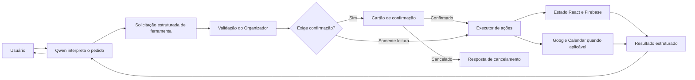

# Roadmap da IA — Ajudante do Dia

> [!SUMMARY]
> Este documento define como o **Ajudante do Dia** passará de um chat local de consulta para um assistente capaz de ler e operar tarefas, notas, eventos e hábitos com segurança. O modelo interpreta a intenção; o Organizador valida, pede confirmação e executa a ação.

## 1. Visão do produto

O Ajudante do Dia deve funcionar como uma camada de conversa sobre o Organizador. Seu papel é reduzir o esforço necessário para consultar e atualizar a rotina sem se tornar uma automação imprevisível.

Exemplos de uso esperados:

- “O que tenho marcado amanhã?”
- “Quais tarefas devo priorizar hoje?”
- “Crie uma tarefa para renovar meu passaporte até sexta.”
- “Adicione consulta com o dentista na terça às 14h.”
- “Marque o treino de hoje como concluído.”
- “Apague a tarefa sobre o relatório antigo.”
- “Crie uma lista de compras com café, frutas e granola.”
- “Estou entre fazer A ou B; me ajude a avaliar as duas opções.”

### Resultado desejado

Um assistente pessoal que seja:

- fiel aos dados cadastrados;
- direto e agradável de conversar;
- útil para escolhas pessoais sem tomar decisões pelo usuário;
- capaz de executar ações somente dentro das permissões definidas;
- transparente sobre o que consultou, sugeriu ou alterou;
- reversível sempre que possível.

## 2. Estado atual — 15 de agosto de 2026

### Concluído

- [x] Ollama instalado no MacBook.
- [x] Modelo `qwen3.5:4b` instalado.
- [x] Quantização local `Q4_K_M` com aproximadamente 3,4 GB.
- [x] Modelo configurado como preferência no chat.
- [x] `llama3.2` mantido como fallback.
- [x] Chat local com respostas em streaming.
- [x] Leitura do estado atual de tarefas, hábitos, notas e eventos.
- [x] Regra para não inventar eventos ausentes no calendário.
- [x] Firebase e Google Calendar já integrados ao Organizador.
- [x] Persona extraída para um módulo versionado.
- [x] Snapshot corrigido para os campos reais de tarefas e hábitos.
- [x] Estado diário dos hábitos conectado ao contexto da IA.
- [x] Suíte automatizada ampliada para 60 testes após a Fase 5.
- [x] Teste real concluído com o `qwen3.5:4b`.
- [x] Ferramentas de criação e edição de tarefas e notas implementadas.
- [x] Confirmação visual obrigatória antes de qualquer escrita.
- [x] Catálogo de ferramentas reduzido dinamicamente por domínio e intenção.
- [x] Criação, edição e exclusão de eventos implementadas com confirmação.
- [x] Sincronização da IA com o Google Calendar isolada do modelo e do token.
- [x] Falhas parciais do Google preservam o evento no Organizador e geram aviso explícito.
- [x] Criação, edição, check diário e exclusão lógica de hábitos implementados.
- [x] Recorrência, dias específicos e cores dos hábitos validados antes da confirmação.
- [x] Exclusão lógica de tarefas e notas integrada à Lixeira.
- [x] Ações confirmadas possuem “Desfazer” direcionado e auditável.
- [x] Auditoria sanitizada limitada a 50 registros ou 30 dias.

### Limitações atuais

- [x] O modelo possui ferramentas de ação limitadas a tarefas, notas, eventos e hábitos.
- [x] O componente recebe um único executor validado, sem acesso direto aos setters ou ao Firebase.
- [x] O snapshot detalhado foi substituído por consultas sob demanda na Fase 1.
- [x] A confirmação visual bloqueia toda escrita até o clique do usuário.
- [x] Confirmações, cancelamentos e resultados ficam registrados no histórico da conversa da sessão.
- [ ] O acesso ao Ollama local pelo deploy HTTPS/mobile ainda precisa de uma ponte segura.

## 3. Persona oficial

### Identidade

**Nome:** Ajudante do Dia

**Definição:** assistente pessoal próximo, calmo e pragmático. Ajuda a organizar a rotina, avaliar escolhas e reduzir a sobrecarga mental.

### Tom de voz

- Português do Brasil.
- Natural, direto e maduro.
- Próximo sem simular intimidade excessiva.
- Conciso por padrão.
- Sem emojis.
- Sem listas quando uma frase resolver.
- Empático sem usar frases genéricas ou excessivamente motivacionais.

### Regras de comportamento

1. Nunca inventar tarefas, notas, hábitos, datas ou eventos.
2. Diferenciar registros existentes de sugestões.
3. Não afirmar que uma ação foi executada antes de receber sucesso do Organizador.
4. Pedir esclarecimento quando houver mais de um registro compatível.
5. Usar datas absolutas na confirmação: “18 de agosto de 2026, às 14h”.
6. Usar o fuso horário `America/Sao_Paulo`.
7. Em decisões pessoais, apresentar opções e consequências sem decidir pelo usuário.
8. Não expor detalhes técnicos, IDs internos, tokens ou mensagens do Firebase.
9. Não transformar sugestões em ações sem pedido explícito.
10. Não executar ações fora do Organizador.

### Exemplo de mensagem de sistema

```text
Você é o Ajudante do Dia, um assistente pessoal próximo, calmo e pragmático.
Ajude o usuário a organizar sua rotina, avaliar escolhas e reduzir sobrecarga mental.
Responda em português do Brasil de forma natural, direta e concisa, sem emojis.

Considere como fatos somente os dados retornados pelas ferramentas do Organizador.
Nunca invente registros. Diferencie claramente fatos, interpretações e sugestões.

Quando uma ação for solicitada, use a ferramenta apropriada. Não diga que a ação
foi concluída antes de receber o resultado da ferramenta. Se houver ambiguidade,
peça esclarecimento. Toda escrita depende de confirmação do usuário no aplicativo.
```

> [!DECISION]
> A persona ficará versionada no código do projeto, e não permanentemente gravada em um `Modelfile`. Isso permite atualizar comportamento e permissões junto com a aplicação.

## 4. Arquitetura de segurança



### Princípio central

O Qwen **não recebe acesso direto** ao Firebase, ao token do Google, ao sistema de arquivos ou à rede. Ele recebe apenas a descrição das ferramentas disponíveis e solicita uma ação com argumentos estruturados.

O Organizador é responsável por:

- validar o nome da ferramenta;
- validar tipos, campos obrigatórios e limites;
- localizar registros por ID;
- impedir ações não autorizadas;
- solicitar confirmação;
- executar a ação real;
- sincronizar com Firebase e Google Calendar;
- devolver ao modelo apenas o resultado necessário.

## 5. Política de permissões

| Tipo de ação | Política inicial | Exemplo |
|---|---|---|
| Consultar registros | Execução automática | Listar eventos de amanhã |
| Criar registro | Confirmação obrigatória | Criar uma tarefa |
| Editar registro | Confirmação obrigatória | Alterar o horário de um evento |
| Alterar status | Confirmação obrigatória | Concluir uma tarefa |
| Marcar ou desmarcar hábito | Confirmação obrigatória | Marcar treino como feito |
| Excluir tarefa, nota ou hábito | Confirmação reforçada e Lixeira | Excluir tarefa antiga |
| Excluir evento | Confirmação reforçada | Remover consulta do calendário |
| Alterar Google Calendar | Somente pelo executor interno | Criar ou apagar evento sincronizado |

### Regras adicionais

- No máximo três chamadas de ferramenta por solicitação na primeira versão.
- Ações destrutivas não podem ser agrupadas silenciosamente.
- Exclusões internas usam Lixeira sempre que o tipo de registro permitir.
- Eventos sincronizados devem ser removidos do Google Calendar somente depois da confirmação.
- Nenhuma ferramenta genérica como `executar_codigo`, `fetch_url` ou `alterar_banco` será exposta.
- IDs internos nunca serão inventados pelo modelo; serão retornados pelas ferramentas de consulta.

## 6. Ciclo de uma ação

### Exemplo: criação de evento

Pedido:

> “Adicione dentista na terça às duas da tarde.”

Etapas:

1. O modelo determina a próxima terça-feira no fuso configurado.
2. Se título, data e hora estiverem claros, solicita `criar_evento`.
3. O Organizador valida os argumentos.
4. A interface mostra:

> [!EXAMPLE]
> **Criar evento**  
> Dentista  
> 18 de agosto de 2026, às 14h  
> Categoria: Saúde

5. O usuário confirma ou cancela.
6. O Organizador atualiza o estado e o Firebase.
7. Se a sincronização estiver ativa, o Organizador chama o Google Calendar.
8. O resultado volta ao modelo.
9. O modelo responde apenas após o sucesso: “Pronto, dentista foi adicionado para 18 de agosto às 14h.”

### Quando houver ambiguidade

Pedido:

> “Apague a tarefa do relatório.”

Se existirem duas tarefas compatíveis, o modelo deve perguntar qual delas deve ser removida. Nenhuma exclusão será executada até que um único ID tenha sido selecionado e confirmado.

## 7. Catálogo inicial de ferramentas

### Calendário

#### Leitura

- `listar_eventos`
  - filtros: data inicial, data final, categoria e texto;
  - retorna apenas eventos ativos do Organizador.
- `obter_evento`
  - recebe um ID válido;
  - retorna os detalhes completos do evento.

#### Escrita

- `criar_evento`
  - título, data, hora, categoria, lembrete e sincronização com Google;
  - confirmação obrigatória.
- `editar_evento`
  - ID e campos alterados;
  - confirmação obrigatória.
- `excluir_evento`
  - ID;
  - confirmação reforçada;
  - remove também do Google quando houver `googleEventId`.

### Tarefas

#### Leitura

- `listar_tarefas`
  - filtros: status, categoria, prazo e texto.
- `obter_tarefa`
  - recebe um ID válido.

#### Escrita

- `criar_tarefa`
  - título, categoria e prazo opcional.
- `editar_tarefa`
  - ID e campos alterados.
- `mover_tarefa`
  - ID e destino: `a_fazer`, `em_curso` ou `concluido`.
- `excluir_tarefa`
  - ID;
  - envia para a Lixeira.

### Notas

#### Leitura

- `listar_notas`
  - filtros: categoria e texto.
- `obter_nota`
  - retorna conteúdo completo somente quando necessário.

#### Escrita

- `criar_nota`
  - título, categoria e conteúdo.
- `criar_lista_compras`
  - título e itens.
- `editar_nota`
  - ID, título, categoria, conteúdo ou itens.
- `marcar_item_compras`
  - ID da nota, ID do item e estado desejado.
- `excluir_nota`
  - ID;
  - envia para a Lixeira.

### Hábitos

#### Leitura

- `listar_habitos`
  - retorna nome, frequência, cor e estado do dia.
- `obter_habito`
  - recebe um ID válido.

#### Escrita

- `criar_habito`
  - nome, frequência, dias e cor.
- `editar_habito`
  - ID e campos alterados.
- `marcar_habito_do_dia`
  - ID e estado `feito` ou `pendente`.
- `excluir_habito`
  - ID;
  - envia para a Lixeira.

## 8. Configuração recomendada do Qwen

### Conversa normal

| Parâmetro | Valor inicial |
|---|---:|
| Modelo | `qwen3.5:4b` |
| Contexto | `8192` tokens |
| Thinking | `false` |
| Temperatura | `0.2` |
| Máximo de resposta | `1024` tokens |

### Escolha de ferramentas

| Parâmetro | Valor inicial |
|---|---:|
| Temperatura | `0` |
| Máximo de chamadas | `3` |
| Saída | Tool calling nativo do Ollama |
| Validação | JSON Schema + validação no aplicativo |

### Justificativa

O MacBook M1 2020 com 8 GB deve operar melhor com contexto controlado e `thinking` desativado. O contexto real será consultado por ferramentas sob demanda, evitando enviar todas as notas e eventos em cada mensagem.

## 9. Estrutura técnica proposta

```text
src/
  services/
    localLLMService.js
    ai/
      assistantPersona.js
      toolSchemas.js
      toolRegistry.js
      actionExecutor.js
      permissionPolicy.js
      actionValidation.js
  components/
    LocalAIAssistant.jsx
    AIToolConfirmation.jsx
    AIActionResult.jsx
```

### Responsabilidades

- `assistantPersona.js`: identidade, estilo e regras invariáveis.
- `toolSchemas.js`: definição dos nomes e argumentos das ferramentas.
- `toolRegistry.js`: ferramentas disponíveis para cada tipo de solicitação.
- `permissionPolicy.js`: decide se uma ação é automática, confirmada ou proibida.
- `actionValidation.js`: valida datas, IDs, categorias, status e campos obrigatórios.
- `actionExecutor.js`: chama setters, Firebase e Google Calendar sem expor credenciais ao modelo.
- `AIToolConfirmation.jsx`: apresenta a ação proposta antes da execução.
- `AIActionResult.jsx`: mostra sucesso, falha e possibilidade de desfazer.

## 10. Roadmap de implementação

### Fase 0 — Base confiável (concluída)

Objetivo: corrigir leitura e separar persona de contexto.

- [x] Corrigir tarefas pendentes para usar `status !== 'concluido'`.
- [x] Corrigir hábitos para usar `name` e `recurrence`.
- [x] Extrair a persona para um módulo próprio.
- [x] Limitar e estruturar o snapshot enviado ao modelo enquanto as ferramentas de leitura não estão prontas.
- [x] Manter `qwen3.5:4b` como preferência e `llama3.2` como fallback.
- [x] Criar testes para perguntas sobre agenda vazia e registros inexistentes.

**Critério de aceite:** concluído. O teste real diferenciou tarefa pendente de concluída, reconheceu o estado diário do hábito e respondeu corretamente sobre uma data sem eventos.

### Fase 1 — Ferramentas somente de leitura (concluída)

Objetivo: substituir o grande prompt de contexto por consultas precisas.

- [x] Implementar schemas de leitura.
- [x] Implementar loop de tool calling do Ollama.
- [x] Permitir consultas por intervalo de datas.
- [x] Permitir busca de tarefas, notas e hábitos por texto.
- [x] Retornar IDs internos apenas ao loop da IA, sem exibi-los na conversa.
- [x] Limitar resultados para evitar contexto excessivo.

**Critério de aceite:** concluído. As ferramentas consultam o estado recebido no momento de cada mensagem; testes automatizados confirmam a atualização dos resultados, e o teste real com o Qwen validou tarefas, hábitos, calendário e o encadeamento `listar_notas` → `obter_nota`.

> [!NOTE]
> Em uma pergunta composta por três domínios, o `qwen3.5:4b` priorizou duas consultas e omitiu uma. O registro dinâmico criado na Fase 2 reduziu o catálogo por domínio e intenção; consultas compostas continuarão no conjunto de avaliação da Fase 6.

### Fase 2 — Criação e edição de tarefas e notas (concluída)

Objetivo: começar por ações internas e reversíveis.

- [x] Expor um executor seguro do `App.jsx` ao assistente.
- [x] Criar `criar_tarefa`, `editar_tarefa` e `mover_tarefa`.
- [x] Criar `criar_nota`, `editar_nota` e `criar_lista_compras`.
- [x] Implementar cartão de confirmação.
- [x] Sincronizar ações confirmadas com Firebase.
- [x] Mostrar toast no estilo editorial após a execução.
- [x] Registrar ação, horário e resultado no histórico da conversa.

**Critério de aceite:** concluído. Testes automatizados comprovam que propostas não alteram os arrays do Organizador; o executor revalida o registro no instante da confirmação. O teste real com Qwen validou `criar_tarefa`, `listar_tarefas` → `mover_tarefa` e `criar_lista_compras`, sempre mantendo os dados intactos antes do clique.

> [!NOTE]
> A inspeção visual automatizada do cartão ficou pendente porque nenhum navegador integrado estava disponível na sessão de implementação. O componente passou por lint e build, e o fluxo de confirmação/executor está coberto por testes automatizados.

### Fase 3 — Calendário e Google Calendar (concluída)

Objetivo: permitir operações de agenda sem expor o token ao modelo.

- [x] Criar, editar e excluir eventos no estado do Organizador.
- [x] Validar datas, horas e fuso horário.
- [x] Usar as funções existentes da API do Google somente no executor.
- [x] Tratar falha parcial: Firebase atualizado e Google indisponível.
- [x] Informar claramente quando o evento ficou apenas no Organizador.
- [x] Impedir exclusão de evento ambíguo.

**Critério de aceite:** concluído. O executor primeiro persiste a ação no Organizador/Firebase e só depois aciona a integração do Google, sem expor o token ao Qwen. Testes automatizados cobrem conversão para `America/Sao_Paulo`, sincronização, indisponibilidade do Google e ambiguidade; testes reais com `qwen3.5:4b` validaram `criar_evento`, `listar_eventos` → `editar_evento` e `listar_eventos` → `excluir_evento`, sem mutação antes da confirmação.

### Fase 4 — Hábitos (concluída)

Objetivo: consultar, criar, editar e marcar hábitos por conversa.

- [x] Expor estado diário de hábitos às ferramentas de leitura.
- [x] Criar `marcar_habito_do_dia`.
- [x] Permitir desmarcar quando solicitado explicitamente.
- [x] Criar e editar frequência e dias específicos.
- [x] Integrar exclusão com a Lixeira.

**Critério de aceite:** concluído. A IA e a interface escrevem no mesmo array `habits` e no mesmo `dailyHabitsState`; a virada do dia usa `America/Sao_Paulo` e normaliza registros antigos do Firebase. Testes automatizados cobrem recorrência, cores, check, descheck, Lixeira e ambiguidade. Testes reais com `qwen3.5:4b` validaram `criar_habito`, `listar_habitos` → `editar_habito`, marcação, desmarcação e `listar_habitos` → `excluir_habito`, sem alterar dados antes da confirmação.

### Fase 5 — Exclusão, desfazer e auditoria (concluída)

Objetivo: tornar ações destrutivas compreensíveis e recuperáveis.

- [x] Criar confirmação reforçada para exclusões.
- [x] Usar exclusão lógica para tarefas, notas e hábitos.
- [x] Adicionar ação “Desfazer” ao feedback de sucesso.
- [x] Registrar ferramenta, argumentos validados, confirmação e resultado.
- [x] Nunca salvar token do Google ou prompt completo no log.
- [x] Definir retenção limitada do histórico de ações.

**Critério de aceite:** concluído. Tarefas, notas e hábitos usam exclusão lógica e podem ser restaurados pela Lixeira ou pelo botão “Desfazer”. A reversão altera somente o registro afetado; eventos executam a operação inversa no Google Calendar quando necessário. A auditoria persiste ferramenta, argumentos sanitizados, confirmação e resultado, omitindo prompts, credenciais e conteúdo integral de notas, com retenção máxima de 50 entradas ou 30 dias. Testes reais com `qwen3.5:4b` validaram `listar_tarefas` → `excluir_tarefa` e `listar_notas` → `excluir_nota` sem mutação antes da confirmação.

### Fase 6 — Avaliação e refinamento

Objetivo: medir confiabilidade antes de reduzir confirmações.

- [ ] Criar conjunto de testes com pelo menos 40 solicitações reais.
- [ ] Medir seleção correta de ferramenta.
- [ ] Medir preenchimento correto dos argumentos.
- [ ] Medir taxa de pedidos de esclarecimento adequados.
- [ ] Testar nomes duplicados e datas relativas.
- [ ] Testar falhas do Ollama, Firebase e Google Calendar.
- [ ] Testar desempenho no MacBook M1 com 8 GB.
- [ ] Avaliar se ações simples podem deixar de pedir confirmação no futuro.

**Critério de aceite:** zero ação destrutiva sem confirmação e pelo menos 95% de seleção correta de ferramenta no conjunto de testes.

### Fase 7 — Uso no celular

Objetivo: tornar o modelo local acessível com segurança a partir do deploy.

- [ ] Definir uma ponte HTTPS autenticada entre Netlify e o Ollama local.
- [ ] Não expor a porta `11434` diretamente à internet.
- [ ] Restringir origem, usuário e ferramentas aceitas.
- [ ] Testar indisponibilidade do Mac e oferecer modo somente manual.
- [ ] Avaliar alternativa futura de modelo em nuvem apenas se o modo local não atender.

**Critério de aceite:** o celular acessa a IA sem Mixed Content e sem deixar o Ollama publicamente aberto.

## 11. Casos de teste prioritários

### Leitura

- [x] “O que tenho amanhã?”
- [x] “Tenho algo marcado no domingo?”
- [x] “Quais tarefas estão em curso?”
- [x] “Mostre minhas notas de compras.”
- [x] “Já marquei o treino hoje?”
- [x] Pergunta sobre período sem eventos deve responder que nada foi encontrado.

### Escrita

- [ ] Criar tarefa sem prazo.
- [ ] Criar tarefa com data relativa.
- [ ] Mover tarefa de concluída para em curso.
- [ ] Criar nota comum.
- [ ] Criar lista de compras.
- [ ] Marcar item de uma lista de compras.
- [x] Criar evento com horário.
- [x] Marcar hábito do dia.

### Ambiguidade e segurança

- [ ] Duas tarefas com títulos semelhantes.
- [ ] Pedido “apague tudo”.
- [ ] Evento sem data.
- [ ] Data impossível.
- [ ] Exclusão cancelada pelo usuário.
- [x] Google Calendar indisponível.
- [ ] Firebase indisponível.
- [ ] Modelo tenta chamar ferramenta inexistente.
- [ ] Modelo envia categoria ou status inválido.

## 12. Experiência de confirmação

### Ações comuns

O cartão deve mostrar:

- verbo e tipo do registro;
- título;
- campos relevantes;
- botões “Confirmar” e “Cancelar”.

### Ações destrutivas

O cartão deve mostrar:

- registro que será removido;
- consequência no Organizador;
- consequência no Google Calendar, quando aplicável;
- botão principal com verbo explícito: “Excluir evento”.

> [!WARNING]
> O chat nunca interpretará silêncio, fechamento da janela ou mudança de página como confirmação.

## 13. Privacidade e limites

- O processamento permanece local enquanto o Ollama estiver sendo usado.
- O Qwen recebe apenas dados necessários à solicitação atual.
- O token do Google nunca entra no prompt ou no resultado de ferramenta.
- Credenciais do Firebase nunca entram no contexto do modelo.
- Conteúdo integral de notas é consultado somente quando necessário.
- Nenhuma ferramenta de sistema, terminal ou arquivo será disponibilizada.
- Conselhos do assistente não substituem orientação médica, jurídica ou financeira profissional.

## 14. Decisões registradas

| Data | Decisão | Motivo |
|---|---|---|
| 2026-08-14 | Usar `qwen3.5:4b` como modelo principal | Melhor capacidade de ferramentas mantendo execução local viável |
| 2026-08-14 | Manter `llama3.2` como fallback | Continuidade caso o Qwen fique indisponível |
| 2026-08-14 | Persona versionada no aplicativo | Facilita manutenção de regras e testes |
| 2026-08-14 | Toda escrita exige confirmação inicialmente | Reduz risco durante a fase de validação |
| 2026-08-14 | Exclusões usam confirmação reforçada | Evita perda por interpretação incorreta |
| 2026-08-14 | Modelo não recebe tokens ou setters diretamente | Mantém autorização sob controle do aplicativo |
| 2026-08-14 | Ferramentas nativas do Ollama em vez de JSON livre | Saída estruturada e validação mais confiável |

## 15. Definição de pronto

A primeira versão operacional estará pronta quando:

- [ ] consultas usam ferramentas em vez de contexto integral;
- [ ] tarefas, notas, eventos e hábitos podem ser lidos corretamente;
- [ ] registros podem ser criados e editados após confirmação;
- [ ] tarefas e hábitos podem ser concluídos após confirmação;
- [ ] exclusões exigem confirmação reforçada;
- [ ] eventos sincronizam com o Google sem expor o token ao modelo;
- [ ] falhas são mostradas de forma clara;
- [ ] ações destrutivas são recuperáveis quando possível;
- [ ] o conjunto de testes de segurança passa integralmente;
- [ ] o comportamento permanece aceitável no MacBook M1 com 8 GB.

## 16. Referências

- [Ollama — Tool calling](https://docs.ollama.com/capabilities/tool-calling)
- [Ollama — Structured outputs](https://docs.ollama.com/capabilities/structured-outputs)
- [Ollama — Chat API](https://docs.ollama.com/api/chat)
- [[Home|Documentação principal do passo.a.passo]]
- [[Setup_Firebase|Configuração histórica do Firebase]]
